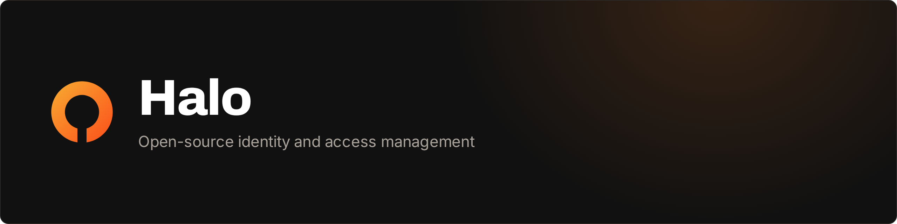
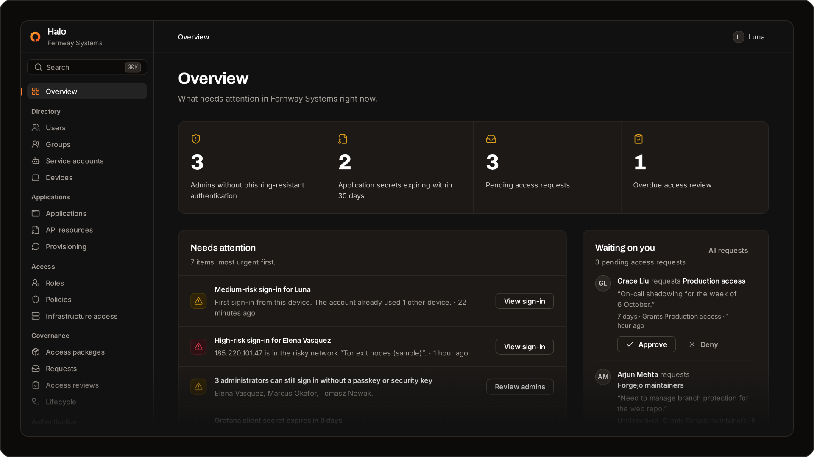
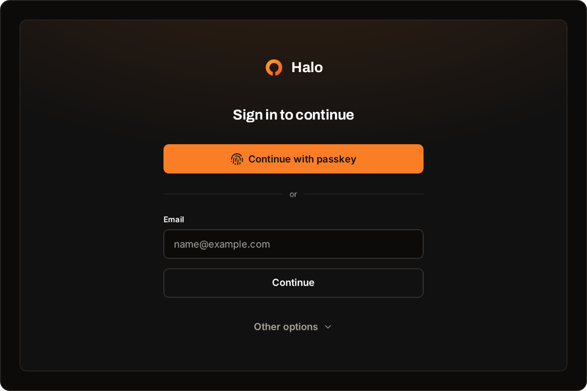
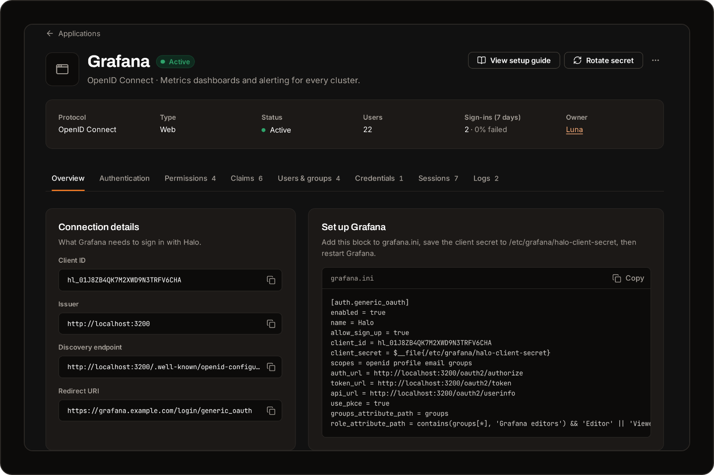
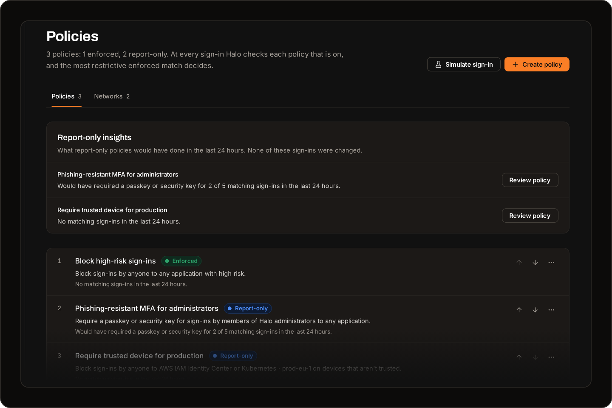
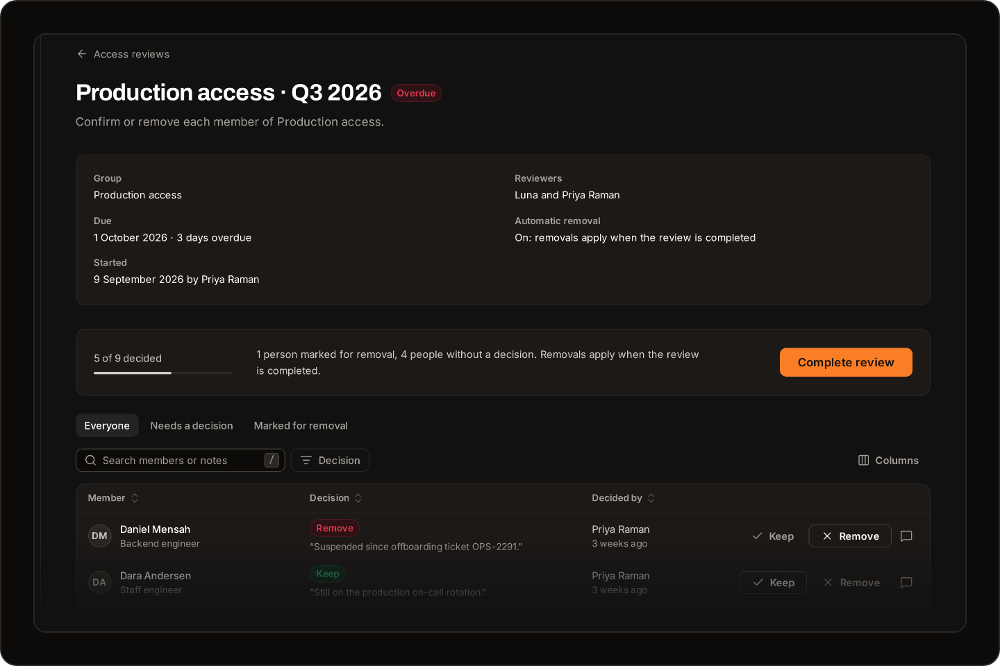
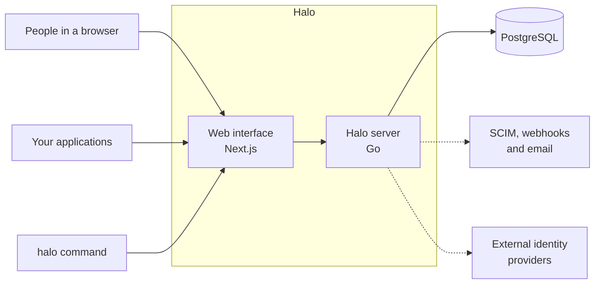

<h1></h1>

[](https://github.com/ScalaStudios/Halo/actions/workflows/ci.yml)
[](CHANGELOG.md)
[](LICENSE)

**Halo is an open-source identity and access management (IAM) platform that you host yourself.** It is where your organization decides who can sign in to which applications, how they prove who they are, and how long their access lasts.

In identity terms, Halo is an identity provider (IdP) for single sign-on (SSO) over OpenID Connect (OIDC) and SAML 2.0, with passwordless sign-in through passkeys, SCIM 2.0 provisioning, conditional access policies and identity governance. It comes with its own directory, admin console and account portal: it is not an authentication library or a proxy in front of your applications.

[Website](https://halo.scala.gg) · [Quick start](#quick-start) · [Documentation](documentation/README.md) · [Integrations](#connect-your-first-application) · [Security](SECURITY.md)

> [!NOTE]
> Halo is pre-release. The features below work on `main`, but there is no tagged release yet, and the API and configuration may change before 1.0. [CHANGELOG.md](CHANGELOG.md) lists what is included.



## Why Halo

Halo works in the same space as hosted services such as Microsoft Entra ID, Okta and Auth0, and open-source projects such as Keycloak, authentik and ZITADEL. It is built around a few choices:

- **No passwords.** People sign in with passkeys and security keys, which are phishing-resistant. Authenticator apps, recovery codes and emailed sign-in links are fallbacks that you can turn off.
- **Access that ends.** Access packages with approvers and time limits, access reviews, and joiner, mover and leaver rules are part of the core product.
- **Policies you can test before they apply.** Report-only mode shows what a policy would have done to the last 24 hours of sign-ins, and the simulator shows how your policies would treat a given sign-in.
- **Small to run.** A Go server, a Next.js web interface and PostgreSQL. No Redis, no message queue and no license key.
- **Open source.** Every feature is in this repository, licensed under Apache-2.0, and users, groups, applications and policies export as JSON.

## Features

| Area | What Halo includes |
| --- | --- |
| **Sign-in** | Passkeys and security keys (WebAuthn), authenticator apps (TOTP), single-use recovery codes and magic links by email. Sign-in through Google, Microsoft Entra ID, GitHub or any OpenID Connect provider, with account linking and accounts created on first sign-in. |
| **Single sign-on** | An OpenID Connect provider and OAuth 2.0 authorization server for web, single-page, native and machine-to-machine applications. A SAML 2.0 identity provider with service provider metadata import and IdP-initiated sign-in. |
| **Directory** | People with profiles and managers, assigned groups and rule-based groups such as `user.department == "Engineering"`, service accounts, devices, and six administrative roles. |
| **Provisioning** | A SCIM 2.0 server, tested with the request formats of Okta and Microsoft Entra ID, so either of them or an HR system can provision people into Halo; and outbound SCIM that creates, updates and deactivates accounts in your applications. |
| **Access policies** | Conditional access by person, group, application, network zone, device trust, sign-in risk and sign-in method, with effects that allow, block or require a passkey or security key, report-only mode and a simulator. |
| **Governance** | Access packages that people request, with approvers, justifications and time limits; access reviews that can remove access automatically when they complete; and joiner, mover and leaver rules. |
| **Infrastructure access** | An SSH certificate authority that issues short-lived certificates to people in mapped groups, through `halo login` and `halo ssh-cert`. |
| **Monitoring** | A sign-in log, an audit log of every administrative change, risk events for risky networks, repeated failures, new devices and new networks, and signed webhooks for audit and sign-in events. |
| **Administration** | An admin console and a self-service account portal, organization branding, sign-in methods you can switch off, email over SMTP with retries, JSON export, and rotation of client secrets, signing keys and `HALO_SECRET_KEY`. |
| **Developers** | A REST API described by an OpenAPI 3.1 document, API keys for service accounts, API resources with their own scopes and JWT access tokens, and setup guides with ready-made configuration for common applications. |

Not built yet: LDAP directory sync and pushing groups over outbound SCIM. See the [roadmap](#roadmap).

## Supported standards

| Standard | Status | How Halo uses it |
| --- | --- | --- |
| OpenID Connect Core 1.0 and Discovery 1.0 | Implemented | ID tokens signed with RS256, userinfo, `prompt` and `max_age`, discovery at `/.well-known/openid-configuration`, and RP-initiated logout |
| OAuth 2.0 (RFC 6749) | Implemented | Authorization code, refresh token and client credentials grants; refresh tokens rotate by default, and a used one is rejected |
| PKCE (RFC 7636) | Implemented | `S256`, required for single-page and native applications |
| Device Authorization Grant (RFC 8628) | Implemented | Used by `halo login` to sign people in on the command line |
| Token Introspection (RFC 7662) and Revocation (RFC 7009) | Implemented | Introspection for APIs that check opaque tokens, and revocation for applications that sign people out |
| Resource Indicators (RFC 8707) | Partial | The `resource` parameter selects an API resource on authorization, device and client credentials requests, and its JWT access tokens carry it in `aud` |
| SAML 2.0 | Implemented | Web browser single sign-on as an identity provider: SP- and IdP-initiated, HTTP-Redirect and HTTP-POST bindings, signed assertions and metadata. No single logout or encrypted assertions |
| SCIM 2.0 (RFC 7643 and RFC 7644) | Implemented | A server for users and groups with `eq` filters and no bulk operations, and a client that provisions users into applications |
| WebAuthn and FIDO2 | Implemented | Passkeys and security keys as discoverable credentials, for sign-in without a username |
| TOTP (RFC 6238) | Implemented | Six-digit codes from authenticator apps |
| LDAP | Not implemented | Planned |

"Implemented" means the feature works on `main`. Halo has not been through OpenID Foundation conformance testing or any other certification.

## Quick start

### Install on a server

You need a Linux server with Docker Engine, the Docker Compose plugin, `git` and `openssl`, a domain name such as `auth.example.com` that points at the server, and ports 80 and 443 open to the internet.

```bash
curl -fsSL https://halo.scala.gg/install.sh | sh
```

The script asks for your domain and organization name, downloads Halo to `/opt/halo` (or `~/halo` when you are not root), generates a database password and `HALO_SECRET_KEY`, then downloads and starts PostgreSQL, Halo and Caddy, which obtains a TLS certificate for your domain. [Read the script](deploy/install.sh) before you run it if you prefer.

When it finishes, create the first administrator with the command it prints:

```bash
cd /opt/halo/deploy
docker compose exec halo-server halo bootstrap --email you@example.com --name "Your Name"
```

Open the link it prints and register a passkey. The console is at `https://auth.example.com/admin`. To install step by step instead, and for backups, upgrades and email, follow [deploy/README.md](deploy/README.md).

### Run from source

To work on Halo or try it on your own computer, you need Go 1.27, [Bun](https://bun.sh) 1.3 or Node.js 22, and Docker.

```bash
git clone https://github.com/ScalaStudios/Halo.git && cd halo
docker compose -f compose.dev.yml up -d
cp .env.example .env
```

Set `HALO_SECRET_KEY` in `.env` to the output of `openssl rand -base64 32`. Then create an administrator and start the server:

```bash
set -a && . ./.env && set +a
go run ./cmd/halo bootstrap --email you@example.com --name "Your Name"
go run ./cmd/halo serve
```

Start the web interface in a second terminal:

```bash
cd web && bun install && bun run dev
```

Open the setup link that `bootstrap` printed to register your passkey. Halo runs at http://localhost:3200. To explore a populated organization instead, `go run ./cmd/halo seed-demo` loads Fernway Systems, a demo company with 68 people; [Get started](documentation/getting-started.md#explore-with-demo-data) explains how to sign in to it.

## Connect your first application

1. In the console, open **Applications**, choose **Add application**, then **OpenID Connect** and **Web application**. Pick a template such as **Grafana**, or **Custom**.
2. Enter the application's redirect URI and choose **Create application**. Copy the client ID and the client secret; Halo shows the secret only once.
3. Open the application, go to **Users & groups**, and assign the groups whose members may sign in. Until a group is assigned, nobody can.
4. Configure the application with Halo's issuer, such as `https://auth.example.com`. Applications that support discovery read every endpoint from `https://auth.example.com/.well-known/openid-configuration`.

Each application page in the console shows its connection details and a setup guide with your values filled in. For Grafana, the guide is a block for `grafana.ini`:

```ini
[auth.generic_oauth]
enabled = true
name = Halo
allow_sign_up = true
client_id = hl_…
client_secret = $__file{/etc/grafana/halo-client-secret}
scopes = openid profile email groups
auth_url = https://auth.example.com/oauth2/authorize
token_url = https://auth.example.com/oauth2/token
api_url = https://auth.example.com/oauth2/userinfo
use_pkce = true
groups_attribute_path = groups
role_attribute_path = contains(groups[*], 'Grafana editors') && 'Editor' || 'Viewer'
```

Step-by-step guides cover [Grafana](documentation/integrations/grafana.md), [Forgejo](documentation/integrations/forgejo.md), [Nextcloud](documentation/integrations/nextcloud.md), [Kubernetes with kubelogin](documentation/integrations/kubernetes.md), [Proxmox VE](documentation/integrations/proxmox.md), [Outline](documentation/integrations/outline.md) and [Headscale](documentation/integrations/headscale.md) over OpenID Connect, and [AWS IAM Identity Center](documentation/integrations/aws-iam-identity-center.md) and [Slack](documentation/integrations/slack.md) over SAML. For anything else that supports OpenID Connect or SAML 2.0, start from the [generic OpenID Connect](documentation/integrations/generic-oidc.md) or [generic SAML](documentation/integrations/generic-saml.md) guide. [`examples/`](examples) has small Go applications that sign in with Halo over each protocol.

To automate Halo itself, create a service account with the user administrator role and an API key, and call the API. This invites a person and returns their setup link:

```bash
curl -X POST https://auth.example.com/api/v1/users \
  -H "Authorization: Bearer $HALO_API_KEY" \
  -H "Content-Type: application/json" \
  -d '{"email": "sam@example.com", "name": "Sam Lee", "department": "Engineering"}'
```

Every route is described in the OpenAPI document at `/api/v1/openapi.yaml`; the [API guide](documentation/api.md) covers authentication, roles and errors.

## Screenshots

<table>
  <tr>
    <td width="50%"><br>Passkey-first sign-in</td>
    <td width="50%"><br>Connection details and a setup guide for every application</td>
  </tr>
  <tr>
    <td width="50%"><br>Conditional access with report-only insights</td>
    <td width="50%"><br>Access reviews with automatic removal</td>
  </tr>
</table>

## Architecture



The web interface is the only public entry point. It serves the console, the account portal and the sign-in pages, and forwards API and protocol paths to the Go server, so cookies, the OpenID Connect issuer and the passkey domain share one address. The Go server holds the logic, runs background jobs such as email delivery and outbound SCIM, and stores everything in PostgreSQL.

| Path | What it serves |
| --- | --- |
| `/admin`, `/account`, `/sign-in` | The console, the account portal and the sign-in pages |
| `/api/v1/*` | The management and account API, described at `/api/v1/openapi.yaml` |
| `/oauth2/*`, `/.well-known/openid-configuration` | The OpenID Connect provider |
| `/saml/*` | The SAML 2.0 identity provider |
| `/scim/v2/*` | The SCIM 2.0 server |

[Architecture](documentation/architecture.md) covers the Go packages and how a sign-in flows through them.

## Self-hosting

Self-hosted Halo runs on your own infrastructure and needs no external service. A production installation is four containers: PostgreSQL 17, the Halo server, the web interface, and Caddy for TLS. [deploy/README.md](deploy/README.md) is the step-by-step guide.

- **Requirements.** A Linux host with Docker Engine and the Compose plugin, a domain name, and ports 80 and 443 reachable from the internet. Images are published for `linux/amd64` and `linux/arm64`. On a test machine, the four running containers used about 200 MB of memory at idle.
- **Choose a domain you will keep.** Halo's address is the OpenID Connect issuer that every application stores, and passkeys only work on the domain they were created for.
- **Back up two things.** The database, and `HALO_SECRET_KEY`, which encrypts signing keys and other stored secrets. A backup cannot be restored without the key that was in use when it was taken.
- **Run one Halo server.** Some background jobs, such as outbound SCIM, access expiry and lifecycle rules, run in every server process without coordinating with other processes.
- **Email is optional.** Without an SMTP server, administrators pass invite and reset links on themselves. With one, Halo emails them, and people can sign in with magic links.
- **Kubernetes.** There is no Helm chart yet. [Self-hosting](documentation/self-hosting.md#other-ways-to-run-halo) lists what any other deployment needs.

## Halo Cloud

A hosted version of Halo is planned for teams that would rather not run it themselves. Follow [halo.scala.gg](https://halo.scala.gg) for news. Self-hosting is meant to stay complete, with no paid tier for core features and no dependency on proprietary infrastructure.

## Roadmap

Planned:

- A first tagged release; until then, `main` and its images are the only supported version
- Halo Cloud, the hosted version
- LDAP directory sync
- Pushing groups over outbound SCIM

Known limitations today:

- One organization per installation.
- Run a single Halo server; see [Self-hosting](#self-hosting).
- There is no Helm chart yet.
- No metrics endpoint; the server logs requests and errors as structured text.
- Halo has not been through OpenID Connect conformance testing or an independent security audit.

[CHANGELOG.md](CHANGELOG.md) records what has shipped.

## Documentation

- [Get started](documentation/getting-started.md): run Halo locally and sign in to an example application through it.
- [Concepts](documentation/concepts.md): users, groups, roles, applications, sessions and sign-in methods.
- [Configuration](documentation/configuration.md): every environment variable and console setting.
- [Access policies](documentation/policies.md) and [governance](documentation/governance.md): who gets in, under which conditions, and for how long.
- [Federation](documentation/federation.md): sign-in with Google, Microsoft Entra ID, GitHub or another OpenID Connect provider.
- [Provisioning](documentation/provisioning.md): SCIM in both directions, service accounts and API keys.
- [Webhooks](documentation/webhooks.md) and the [API](documentation/api.md): automate Halo and react to its events.
- [Infrastructure access](documentation/infrastructure-access.md): SSH certificates with `halo login` and `halo ssh-cert`.
- [Security model](documentation/security-model.md): how Halo protects sessions, secrets and tokens, and its known limitations.

## Contributing

Bug reports, fixes, documentation and features are welcome. Report bugs and propose features in [GitHub issues](https://github.com/ScalaStudios/Halo/issues), and open an issue before starting anything large, such as a new feature, a new dependency or a schema change. [CONTRIBUTING.md](CONTRIBUTING.md) covers the development setup, the checks CI runs and the code style, and [Architecture](documentation/architecture.md) maps the code. Everyone taking part follows the [Code of Conduct](CODE_OF_CONDUCT.md).

## Security

Report vulnerabilities privately through [GitHub's private vulnerability reporting](https://github.com/ScalaStudios/Halo/security/advisories/new), never in a public issue. [SECURITY.md](SECURITY.md) lists what to include and the response times to expect.

Halo stores session tokens, client secrets, API keys and refresh tokens only as SHA-256 hashes, encrypts signing keys and other stored secrets with AES-256-GCM, writes every administrative change to the audit log in the same transaction, and refuses to start without HTTPS outside development. The [security model](documentation/security-model.md) explains each of these and lists the known limitations.

## License

Halo is licensed under the [Apache License 2.0](LICENSE). Two React Bits components in `web/src/components/reactbits/` keep their own MIT + Commons Clause terms; [NOTICE](NOTICE) has the details.

Halo is a Scala Studios project.
